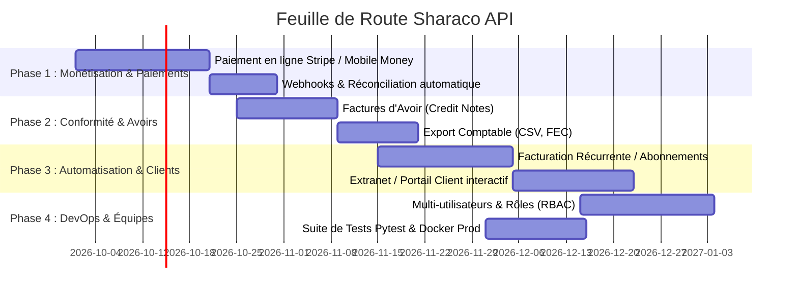

# 🗺️ Sharaco API — Feuille de Route (Roadmap)

> **Dernière mise à jour** : Septembre 2026  
> **Statut global** : Phase MVP consolidée — Transition vers la v1.0 Production & Scaling

---

## 🎯 Vision du Projet

**Sharaco** est une plateforme SaaS de facturation, devis et gestion financière conçue spécifiquement pour les indépendants, agences et TPE/PME (avec un support natif des devises internationales EUR, USD et des devises d'Afrique de l'Ouest/Centrale XOF, FCFA).  
L'API FastAPI assure la gestion du cycle de vie documentaire, le calcul financier rigoureux, la génération haute performance de PDF/PNG, les relances automatiques et les validations électroniques.

---

## 📊 Tableau de Bord d'Avancement Global

| Domaine | Statut | Progression |
| :--- | :---: | :---: |
| **Authentification & Gestion Utilisateurs** | ✅ Réalisé | 90% |
| **Gestion des Clients (CRM Léger)** | ✅ Réalisé | 85% |
| **Moteur Devis & Factures** | ✅ Réalisé | 90% |
| **Échéanciers & Acomptes** | ✅ Réalisé | 85% |
| **Moteur Graphique (Templates, PDF, PNG)** | ✅ Réalisé & Optimisé | 95% |
| **Relances & Détection Retards (Cron)** | ✅ Réalisé | 80% |
| **Projets & Documents Associés** | ✅ Réalisé | 85% |
| **Tableau de Bord & Métriques Financières** | ✅ Réalisé | 80% |
| **Paiements en Ligne (Stripe, Mobile Money)** | ⏳ À Faire | 10% |
| **Avoirs & Conformité Comptable** | ⏳ À Faire | 0% |
| **Facturation Récurrente & Abonnements** | ⏳ À Faire | 15% |
| **Portail Client Extranet Dédié** | 🔄 Partiel | 40% |
| **Tests Automatisés & DevOps (CI/CD, Docker)** | ⏳ À Faire | 30% |

---

## 🟢 1. Ce qui a DÉJÀ été Réalisé

### 1.1 Authentification & Profils (`app/api/v1/auth.py`, `app/models/user.py`)
- [x] Inscription et connexion par email / mot de passe chiffré (Bcrypt).
- [x] Authentification par tokens JWT (`access_token`) avec gestion de session.
- [x] Connexion sociale **Google OAuth2** (redirection & callback automatisés).
- [x] Récupération et mise à jour du profil entreprise (Raison sociale, SIRET/Tax ID, TVA intracommunautaire, coordonnées bancaires IBAN/BIC, adresse, téléphone).
- [x] Support multi-devises personnalisé par utilisateur (EUR, USD, FCFA, XOF, etc.).
- [x] Procédure de réinitialisation de mot de passe par jeton sécurisé.

### 1.2 CRM & Gestion des Clients (`app/api/v1/client.py`, `app/services/clientService.py`)
- [x] CRUD complet des clients (création, consultation, modification, archivage/suppression).
- [x] Isolation stricte des données par utilisateur (Multi-tenant au niveau de la couche données).
- [x] Recherche et filtrage dynamique des clients.
- [x] Association directe avec les devis, factures et projets.

### 1.3 Moteur de Devis & Facturation (`app/api/v1/document.py`, `app/services/documentService.py`)
- [x] Cycle de vie complet des documents : `DRAFT`, `SENT`, `VIEWED`, `ACCEPTED`, `REFUSED`, `PAID`, `OVERDUE`.
- [x] Lignes d'articles dynamiques avec quantités, prix unitaires en centimes (évitant tout problème d'arrondi à virgule flottante) et taux de TVA individuels.
- [x] Calcul automatisé des totaux (Sous-total HT, Total TVA, Total TTC).
- [x] Types de factures gérés : `STANDARD`, `ACOMPTE`, `SOLDE`.
- [x] Conversion intelligente d'un devis en facture avec conservation de la référence source (`source_document_id`).
- [x] Duplication de devis existant ou conversion directe.
- [x] Partage public sécurisé via `share_token` avec date d'expiration configurable.
- [x] Signature électronique en ligne et validation/refus client via jeton privé `client_token` (avec motif de refus enregistré).

### 1.4 Échéanciers de Paiement (`app/api/v1/payment_schedule.py`, `app/models/payment_schedule.py`)
- [x] Découpage d'un devis/facture en plusieurs jalons de paiement (ex: 30% acompte, 40% livraison, 30% solde).
- [x] Gestion des statuts de chaque jalon : `PENDING`, `INVOICED`, `PAID`.
- [x] Suivi visuel de l'échéancier intégré directement sur les devis et factures.

### 1.5 Moteur Graphique, PDF & Prévisualisation PNG (`app/services/pdfRenderer.py`)
- [x] 8 styles graphiques HTML/CSS modernes : `Classic`, `Modern`, `Minimal`, `Bold`, `Elegant`, `Premium`, `Bento`, `Studio`.
- [x] Personnalisation des templates : logo d'entreprise, couleurs primaires/secondaires, polices typographiques, affichage conditionnel des mentions légales et coordonnées bancaires.
- [x] Rendu PDF vectoriel haute définition au format A4 via Chromium Playwright.
- [x] **Rendu PNG ultra-performant** (`GET /{document_id}/preview.png`) :
  - Chromium persistant en singleton (gain de latence de ~3500ms à **~300ms**).
  - Cache hybride à double niveau : **Mémoire vive LRU (0.04ms)** + **Disque persistant (0.43ms)**.
  - Déduplication de requêtes simultanées (*Single-flight*) et sémaphore de protection CPU.
  - Support de l'en-tête **ETag** et réponse **HTTP 304 Not Modified** (< 2ms, 0 transfert réseau).
  - Quota disque automatique LRU (500 fichiers max) et suppression automatique des images périmées lors de la mise à jour d'un document.
  - Paramètre de redimensionnement de miniature `?width=400` pour un affichage fluide des grilles sur le frontend.

### 1.6 Relances & Détection des Factures Échues (`app/api/v1/reminder.py`, `app/cron/`, `main.py`)
- [x] Tâche automatisée APScheduler exécutée quotidiennement pour détecter les factures dont la date d'échéance est dépassée et passer leur statut à `OVERDUE`.
- [x] Système de relances par email avec templates personnalisables.
- [x] Double connecteur d'envoi d'emails : **SMTP** standard et **Resend API**.
- [x] Historique et journalisation des relances envoyées.

### 1.7 Projets & Suivi d'Activité (`app/api/v1/project.py`, `app/api/v1/dashboard.py`, `app/api/v1/activity.py`)
- [x] Création et gestion de projets regroupant plusieurs documents d'un même client.
- [x] Suivi du budget projet, du montant facturé et du montant encaissé.
- [x] Dashboard financier complet : chiffre d'affaires total, montants en attente, montants en retard, taux de conversion des devis.
- [x] Journal d'activité chronologique (création, consultation, signature, paiement).

---

## 🟡 2. Ce qui Reste à Faire (Roadmap Évolutive)

### Priorité 1 : Paiements en Ligne & Clôture Automatique (Court terme)
1. **Intégration Passerelles de Paiement** :
   - [ ] Intégration **Stripe Checkout** pour cartes bancaires internationales (EUR, USD).
   - [ ] Intégration passerelles **Mobile Money** pour l'Afrique de l'Ouest et Centrale (CinetPay, FedaPay ou Paystack pour Orange Money, MTN MoMo, Wave).
2. **Gestion des Webhooks & Passage automatique en `PAID`** :
   - [ ] Endpoints dédiés `/api/v1/payments/webhooks/{provider}` avec vérification de signature cryptographique.
   - [ ] Mise à jour instantanée du statut du document et du jalon d'échéancier associé lors de la réception de la confirmation de paiement.
   - [ ] Envoi automatique du reçu de paiement au client par email.

### Priorité 2 : Conformité Comptable & Factures d'Avoir (Court/Moyen terme)
1. **Factures d'Avoir (Credit Notes)** :
   - [ ] Ajout du type de document `AVOIR` dans le modèle `DocumentType`.
   - [ ] Génération d'avoir partiel ou total lié à une facture existante (règles légales d'annulation sans suppression de la facture d'origine).
   - [ ] Déduction comptable sur le tableau de bord et impact sur les totaux payés.
2. **Export Comptable & Documents Fiscaux** :
   - [ ] Export des écritures de ventes au format CSV / Excel normalisé (colonnes : date, numéro, client, compte HT, compte TVA, compte tiers).
   - [ ] Export FEC (Fichier des Écritures Comptables) conforme aux normes fiscales.

### Priorité 3 : Facturation Récurrente & Abonnements (Moyen terme)
1. **Moteur d'Abonnements & Contrats Récurrents** :
   - [ ] Modèle `RecurringInvoice` : fréquence (mensuelle, trimestrielle, annuelle), date de début, date de fin, prochaine échéance.
   - [ ] Worker Celery / APScheduler exécutant la génération automatique des factures à chaque échéance.
   - [ ] Envoi automatique optionnel au client par email avec lien de paiement.

### Priorité 4 : Portail Client Dédié (Extranet) (Moyen terme)
1. **Espace Client Autonome** :
   - [ ] Accès client par lien magique (*Magic Link*) sans mot de passe complexe.
   - [ ] Dashboard client récapitulant l'ensemble des devis en attente, factures payées et factures dues.
   - [ ] Téléchargement groupé des factures et reçus au format ZIP.

### Priorité 5 : Organisation Multi-utilisateurs & Équipes (RBAC) (Long terme)
1. **Gestion des Équipes** :
   - [ ] Modèle `Organization` ou `Workspace` regroupant plusieurs collaborateurs.
   - [ ] Gestion des rôles : `Owner`, `Admin`, `Billing Manager`, `Member`, `Viewer`.
   - [ ] Attribution des devis/factures par membre de l'équipe et calcul de commissions.

---

## 🛠️ 3. Améliorations Techniques & DevOps

### 3.1 Tests Automatisés & Qualité de Code
- [ ] Mettre en place une suite de tests unitaires et d'intégration avec **Pytest** et **pytest-asyncio**.
- [ ] Couvrir les flux critiques : calculs financiers, transitions de statuts, acceptation de devis, génération PDF/PNG, et permissions multi-tenant.
- [ ] Intégration de vérifications de typage statique (`mypy` ou `pyright`) et de linting (`ruff`).

### 3.2 Conteneurisation & Production
- [ ] Optimisation du `Dockerfile` multi-stage incluant les dépendances Playwright Chromium dans un conteneur allégé.
- [ ] Fichier `docker-compose.yml` complet pour l'environnement de production : API FastAPI + PostgreSQL + Redis + Worker Celery.
- [ ] Pipeline CI/CD GitHub Actions pour l'exécution automatique des tests et le déploiement continu.

### 3.3 Observabilité & Sécurité
- [ ] Intégration de **Sentry** pour le suivi en temps réel des erreurs d'exécution.
- [ ] Rate limiting sur les routes sensibles (connexion, réinitialisation de mot de passe, aperçus publics) via Redis.
- [ ] Logs structurés au format JSON pour centralisation (Grafana Loki, Datadog ou AWS CloudWatch).

---

## 📅 Synthèse des Prochains Jalons (Milestones)

| Jalon | Nom | Objectif Principal | Livrables Clés |
| :---: | :--- | :--- | :--- |
| **v1.0** | **Production Readiness** | Consolidation, conteneurisation et sécurisation | Docker multi-stage, Pytest suite (80%+ couverture), pipeline CI/CD. |
| **v1.1** | **Paiements en Ligne** | Monétisation et encaissement direct | Stripe + Mobile Money (Wave, Orange Money), Webhooks et clôture automatique en `PAID`. |
| **v1.2** | **Conformité & Avoirs** | Rigueur comptable et légale | Module d'Avoirs (Credit Notes), exports comptables CSV/FEC. |
| **v2.0** | **Automatisation & Équipes** | Facturation récurrente et gestion d'agences | Facturation récurrente automatique, portail client complet, support multi-utilisateurs / rôles. |
